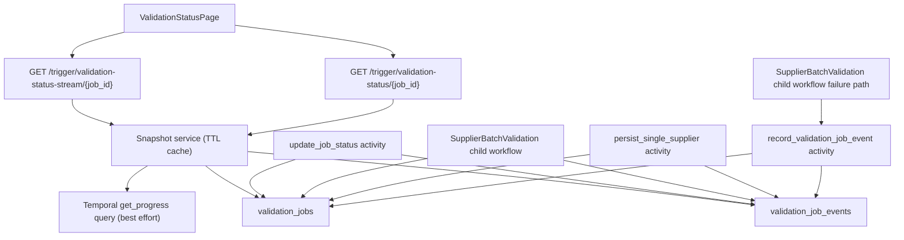

# Live Validation Progress Events

---

## Overview

The validation status page currently polls coarse job state and only sees supplier progress when a whole child batch completes. The result is a status page that looks stalled during the longest part of the workflow even while workers are actively validating suppliers. This spec adds a durable, idempotent validation event log plus authenticated Server-Sent Events so the backend can stream supplier milestones and stage progress to the frontend without consuming Temporal workflow history for every supplier update.

---

## Goals & Non-Goals

### Goals

- Show live supplier progress before a child batch finishes.
- Favor deterministic live signals over speculative ETA or coarse overall percentages on the status page.
- Keep Temporal responsible for coarse workflow orchestration, not high-frequency progress messages.
- Add idempotent, retry-safe supplier milestone events with bounded write volume.
- Stream progress to the status page over authenticated SSE using the existing Basic Auth model.
- Keep the existing `validation-status` JSON endpoint backward compatible while extending it with richer progress data.
- Preserve stale-job monitoring by refreshing `validation_jobs.updated_at` from the new progress path without changing the monitor query shape.
- Enforce org-scoped `(organization_id, job_id)` lookups on status, cancel, and stream paths.

### Non-Goals

- No Redis, Postgres `LISTEN/NOTIFY`, WebSocket, or external pub-sub infrastructure.
- No separate VAT-success or IBAN-success live feed rows in v1.
- No changes to dashboard widgets, `JobContext`, or `/validation-jobs/active`.
- No new ETA prediction or confidence logic. The live page may hide or de-emphasize ETA rather than trying to make the estimate smarter.
- No explicit connection admission control beyond existing backend/proxy capacity.

---

## User Stories

**US1 — Live job progress for operations team**
As an operations team member monitoring a running validation job,
I want to see per-supplier milestone counts update on the status page while a child batch is still running,
so that I can confirm the system is actively working and not stalled during long-running jobs.

**US2 — Idempotent event store for developers**
As a backend developer integrating event writes into Temporal activities,
I want milestone events to be idempotent and retry-safe by design,
so that Temporal retries and activity acknowledgement ambiguity never produce duplicate progress entries.

**US3 — Meaningful live signal for status page users**
As a user watching the validation status page,
I want to see real stage transitions and supplier milestone counts rather than an uncertain ETA,
so that I can make accurate operational decisions about whether the job is progressing normally or needs intervention.

**US4 — Stale-job monitoring integrity for operations**
As a system operator relying on `job_monitor_worker` to detect stuck jobs,
I want long-running name/address validations to keep `validation_jobs.updated_at` refreshed without flooding the event log with intermediate rows,
so that the stale-job monitor never flags an active job as stale while work is in progress.

**US5 — Reliable stream reconnect for frontend users**
As a user who refreshes the status page or experiences a dropped SSE connection,
I want the stream to reconnect and rehydrate the UI from a fresh snapshot plus the last 50 events,
so that I see an accurate, consistent view with no duplicate entries or missing milestones after reconnection.

---

## Acceptance Criteria

**AC1 — Live supplier progress before batch completion**
GIVEN a job is running with at least one active child batch
WHEN a supplier completes its validation phase inside that batch
THEN the status page increments the relevant milestone counter before the child batch workflow terminates

**AC2 — Validated and Failed counters remain monotonic**
GIVEN a supplier that passed `validate_name_address` and emitted `validated.completed`
WHEN `persist_single_supplier` subsequently fails for that supplier
THEN the `Validated` counter retains its prior value AND the `Failed` counter increments, without resetting any previously shown validation progress

**AC3 — Pre-persist counter streams when name/address is disabled**
GIVEN a job where name/address validation is disabled but VAT and/or IBAN validation is enabled
WHEN a supplier clears those enabled validation checks
THEN the pre-persist supplier counter increments live before persistence finishes

**AC4 — Duplicate-detection-only jobs hide the pre-persist counter**
GIVEN a job where only duplicate detection is enabled (VAT, IBAN, and name/address all disabled)
WHEN the status page renders for that job
THEN the pre-persist supplier counter is hidden, and `Persisted` supplier progress plus duplicate stage transitions still stream correctly

**AC5 — Idempotent event deduplication**
GIVEN the same terminal supplier event is delivered more than once due to a Temporal retry or activity acknowledgement ambiguity
WHEN the event writer attempts to insert each delivery
THEN exactly one row exists in `validation_job_events` for that `(organization_id, job_id, dedupe_key)` triple

**AC6 — Org-scoped access enforcement**
GIVEN a request to `GET /trigger/validation-status/{job_id}` or `GET /trigger/validation-status-stream/{job_id}` by a user whose `organization_id` does not match the job's organization
WHEN the server processes the request
THEN the server rejects the request with 403 or 404 and returns no job data

**AC7 — Stale-job monitor never triggers on active long-running name/address**
GIVEN a `validate_name_address` activity that is actively running but has not yet emitted a terminal supplier event
WHEN the activity's background heartbeat loop fires
THEN `validation_jobs.updated_at` is refreshed often enough that `job_monitor_worker` does not flag the job as stale

**AC8 — Stream reconnect rehydrates state correctly**
GIVEN a client that has refreshed the page or experienced an SSE disconnection
WHEN the stream reconnects successfully
THEN the client receives a fresh `snapshot` plus the last 50 events, and the event feed contains no duplicate rows

**AC9 — Unbuffered SSE through nginx**
GIVEN nginx is configured with `proxy_buffering off` for the stream route
WHEN `curl -N` connects to the stream route during a live job
THEN the terminal receives unbuffered SSE output in real time without waiting for the response body to close

**AC10 — Optimistic counter increments without waiting for summary refresh**
GIVEN a live SSE stream with the status page connected
WHEN an incoming supplier `activity` event arrives between summary `progress` events
THEN the visible `Validated`, `Persisted`, or `Failed` counter advances immediately on the client, without waiting for the next summary refresh

**AC11 — ETA is not the primary live-progress signal**
GIVEN a running validation job on the status page
WHEN the page renders its primary live-progress area
THEN elapsed time, current stage state, activity freshness (`last_activity_at`), and supplier milestone counts are the dominant UI elements; the live ETA block is absent from the main page view

---

## Background & Context

The current V2 Temporal pipeline fans out one child workflow per batch. Inside each child, suppliers run `VAT + IBAN -> name/address -> persist`. The parent workflow only increments `suppliers_processed` when a child batch returns, so the UI cannot reflect per-supplier progress while a long-running batch is still active. Worker logs already contain useful per-supplier information, but those logs are not structured, not persisted for the UI, and are unsafe to derive directly into user-facing progress.

Temporal workflow queries are appropriate for coarse current state, but not for emitting every supplier transition. The live supplier feed therefore needs an app-side durable event store that activities and workflow milestone updates can write to safely under retries.

---

## Architecture

Component responsibilities:

- `validation_job_events`: durable, append-only, idempotent live progress feed.
- Event writer helper: write one row with dedupe, then conditionally touch `validation_jobs.updated_at`.
- Snapshot service: merge DB job state, grouped event counts, latest event metadata, and best-effort Temporal stage progress.
- SSE endpoint: send initial snapshot, incremental activity rows, summary refreshes, and a terminal event.
- Frontend stream client: authenticated `fetch`-based SSE reader with reconnect and cleanup.

---

## Detailed Design

### Data model

Add `validation_job_events` with:

- `id BIGSERIAL PRIMARY KEY`
- `organization_id INTEGER NOT NULL`
- `job_id VARCHAR NOT NULL`
- `scope VARCHAR NOT NULL` with values `job` or `supplier`
- `stage VARCHAR NOT NULL`
- `status VARCHAR NOT NULL`
- `supplier_external_id VARCHAR NULL`
- `batch_index INTEGER NULL`
- `message TEXT NOT NULL`
- `payload JSONB NULL`
- `dedupe_key VARCHAR NOT NULL`
- `created_at TIMESTAMP NOT NULL DEFAULT now()`

Constraints and indexes:

- Composite FK `(organization_id, job_id)` -> `validation_jobs (organization_id, job_id)` with `ON DELETE CASCADE`.
- Unique constraint on `(organization_id, job_id, dedupe_key)`.
- Index on `(organization_id, job_id, id)`.

### Event semantics

Supplier events are terminal-only:

- `validated.completed` is emitted by the child workflow after a supplier clears all enabled pre-persist checks. If name/address is enabled, this happens after name/address succeeds. If only VAT and/or IBAN are enabled, this happens after those checks succeed. If supplier validations are enabled at the job level but a specific supplier has no VAT/IBAN inputs, the workflow still emits `validated.completed` once that supplier has cleared the validation phase.
- `validated.failed` is emitted exactly once when the supplier pipeline terminates before validation completes. This includes VAT failure, IBAN failure, name/address failure after Temporal retries exhaust, or any explicit validation-stage failure path.
- `persisted.completed` and `persisted.failed` are emitted by `persist_single_supplier`.

Job events are low-volume stage transitions only:

- `parse`, `suppliers`, `duplicate_detection`, `duplicate_llm`, `persist_duplicates`
- statuses are `running`, `completed`, `failed`, or `cancelled`

Dedupe keys:

- Job events: `job:{stage}:{status}`
- Supplier validation success: `supplier:{supplier_id}:validated:completed`
- Supplier validation failure: `supplier:{supplier_id}:validated:failed`
- Supplier persist success: `supplier:{supplier_id}:persisted:completed`
- Supplier persist failure: `supplier:{supplier_id}:persisted:failed`

All writes use `INSERT ... ON CONFLICT DO NOTHING`. If the row already exists, no heartbeat touch runs.

### Workflow and activity changes

- `update_job_status_activity` accepts `organization_id` and optional stage metadata. It updates `validation_jobs` and writes job-stage event rows for coarse stage changes.
- `SupplierBatchValidationWorkflow` writes `validated.completed` once per supplier after the enabled supplier checks have completed and before persistence starts.
- `validate_name_address_activity` no longer emits supplier milestone rows directly. It runs a background async heartbeat loop that:
  - sends Temporal heartbeats every 30 seconds
  - touches `validation_jobs.updated_at` at most once per minute while the activity is still running
- `persist_single_supplier_activity` writes `persisted.completed` or `persisted.failed`.
- `SupplierBatchValidationWorkflow` records final validation failure events through a small `record_validation_job_event` activity whenever an activity exhausts retries and returns control to the child workflow as `ActivityError`.
- VAT and IBAN success rows are not written in v1. Their outcomes are included in the `validated.completed` payload, along with which checks were enabled and which actually ran.

### Snapshot service

Create a backend snapshot service keyed by `(organization_id, job_id)` with a 2-second in-process TTL. It returns:

- base job data from `validation_jobs`
- best-effort Temporal `get_progress` stage data
- grouped milestone counts from `validation_job_events`
- recent event window (last 50 rows)
- latest `last_event_id`
- `last_activity_at = max(validation_jobs.updated_at, latest event created_at)`

Derived counters:

- `suppliers_validated = count(validated.completed)`
- `suppliers_processed = count(persisted.completed)` for backward compatibility
- `suppliers_failed = count(distinct supplier_external_id where scope='supplier' and status='failed')`
- `supplier_milestones = { validated: { completed, failed }, persisted: { completed, failed } }`

Validation options come from `validation_jobs.validation_params`. The run-validation route must persist those options when the job row is created.

### API and streaming

Extend `ValidationJobStatusResponse` with:

- `suppliers_validated: int`
- `suppliers_failed: int`
- `supplier_milestones: dict`
- `stages: dict`
- `validation_options: dict`
- `last_event_id: int | null`
- `last_activity_at: str | null`

Add `GET /api/v1/trigger/validation-status-stream/{job_id}`:

- uses `(organization_id, job_id)` lookup
- sends `snapshot` first with the full snapshot plus `recent_events`
- polls for new event rows every 1 second
- recomputes the cached summary every 2 seconds
- sends `activity` for each new row
- sends `progress` only when the serialized summary changes
- sends a keepalive comment every 15 seconds
- sends `terminal` with the final snapshot, then closes

Reconnect behavior is intentionally simple: always send a fresh `snapshot` plus the latest 50 events. No incremental replay branch.

### Frontend

Add a stream client in `frontend/src/services/api.ts` that:

- builds the authenticated request with the same Basic Auth header logic as axios
- reads `ReadableStream` chunks through `TextDecoder`
- buffers partial SSE frames across chunk boundaries
- parses `id:`, `event:`, and `data:` lines
- exposes `connect`, `abort`, and reconnect behavior
- retries with `1s`, `2s`, then `5s` backoff
- falls back to 5-second polling after three consecutive stream failures

`ValidationStatusPage.tsx` becomes stream-driven after the initial JSON fetch and renders:

- a top-level stage rail
- counters for `Validated` or `Checked` depending on enabled supplier validations, plus `Persisted` and `Failed`
- a live recent-event feed, capped at 50 rows, newest first
- a disconnected banner when the page has fallen back to polling

### Live UX rendering changes

The status page should stop treating `progress%` and `estimated_remaining_seconds` as the primary live signal.

Observed pain points:

- the ETA is always an estimate and does not help the user understand whether work is actually moving
- supplier counters can visually jump because the backend summary refresh arrives every 2 seconds even though individual supplier `activity` events are already streaming in between
- the most useful truth during long-running validation is "which stage is active" and "how many suppliers have visibly cleared a milestone"

Planned rendering adjustments:

- make the stage rail plus supplier milestone counters the primary live-progress UI
- move coarse `progress%` out of the dominant visual position and instead foreground live supplier counts such as `Validated`, `Persisted`, and `Failed`
- remove the live ETA block from the main page for now; keep elapsed time and recent activity because those are factual rather than predictive
- use `last_activity_at` for freshness/stall messaging instead of asking the user to trust an estimate
- keep the SSE snapshot contract unchanged, but apply incoming `activity` events optimistically on the client so the visible counters increment one-by-one between summary refreshes

Client-side merge strategy:

- treat snapshot/progress payloads as the authoritative durable base
- treat streamed `activity` rows as monotonic optimistic deltas layered on top of the latest base
- only ever merge counters upward on the client (`max` semantics) so a slightly stale summary refresh cannot make the UI count backward
- dedupe optimistic event application by event id so reconnects or repeated deliveries do not inflate counters
- keep the code local to `ValidationStatusPage.tsx`; do not introduce new backend fields or extra endpoints for this UX refinement

---

## Deployment & Configuration

- Add an Alembic migration for `validation_job_events`.
- Update frontend nginx with a dedicated `/api/v1/trigger/validation-status-stream/` location:
  - `proxy_buffering off`
  - `proxy_cache off`
  - `proxy_http_version 1.1`
  - `proxy_read_timeout 7200s`
  - `add_header X-Accel-Buffering no`
- No new environment variables are required for v1.

---

## Constraints & Trade-offs

- Terminal-only supplier events reduce hot-path writes and avoid duplicate `started` rows under Temporal retries.
- Using the DB as the durable event store is simpler than introducing a separate broker, but requires a TTL cache to avoid repeated hot-path aggregations.
- The stream uses polling against `validation_job_events` every second instead of push notifications. This is acceptable for v1 because the page count is low and the query is indexed.
- `validation_jobs.updated_at` remains the stale-job heartbeat source to avoid widening the monitor query. The trade-off is a small side effect in the event writer and long-running name/address heartbeat loop.
- Fresh-snapshot reconnects are simpler and more predictable than partial replay. The trade-off is a slightly larger reconnect payload.

---

## Implementation Order

1. Write and review this spec.
2. Add the migration and ORM model for `validation_job_events`.
3. Add the event repository/helper and the conditional heartbeat touch helper.
4. Update `update_job_status_activity` and workflow call sites to carry `organization_id` and stage metadata.
5. Emit supplier terminal events from the child workflow validation phase, `persist_single_supplier`, and the child-workflow failure path.
6. Add the snapshot service and extend `validation-status` JSON response.
7. Add the SSE stream route and nginx override.
8. Add the frontend stream client and status-page UI updates.
9. Refine the status-page rendering to use optimistic activity-driven counters and de-emphasize coarse percent/ETA.
10. Add and run targeted backend tests, frontend lint/build checks, and manual Docker verification.

---

## Out of Scope

- Live progress in dashboard cards or the global active-jobs banner
- Progress history export APIs
- Per-stage retry counters in the UI
- VAT/IBAN success rows in the recent feed
- ETA calculation improvements

---

## Glossary

- `Validated`: a supplier cleared the pre-persist validation phase. With name/address enabled this means full name/address validation succeeded; with VAT/IBAN-only runs it means the supplier cleared those checks.
- `Persisted`: a supplier's published state was written to supplier-side tables.
- `Terminal supplier event`: a final supplier milestone row that should exist at most once logically.
- `Snapshot service`: backend helper that combines DB job state, event aggregates, and Temporal query data into one status response.
- `Fresh-snapshot reconnect`: stream reconnect strategy that always starts with the latest full snapshot plus the last 50 events.
