# Specification Driven Development using Coding Agents

> [!abstract] TL;DR
> Specification Driven Development (SDD) flips the traditional relationship between specs and code — **the spec is the primary artifact; code is a generated output**. As AI coding agents mature, the developers who win are those who master writing specifications, not just prompts. This report maps the full landscape: origin, mental models, tools, architectures, and a practical framework for your team.

> [!note]- Table of Contents
> **1. [[#1. The Origin Story: How We Got Here|The Origin Story]]**
> - [[#Why MDD Failed (and What's Different Now)|Why MDD Failed]]
>
> **2. [[#2. What is Specification Driven Development?|What is Specification Driven Development?]]**
> - [[#The Core Mental Model|The Core Mental Model]]
> - [[#The Three Levels of SDD|The Three Levels of SDD]]
>
> **3. [[#3. The Foundation: Context Engineering|The Foundation: Context Engineering]]**
> - [[#What is Context Engineering?|What is Context Engineering?]]
> - [[#Context Rot: The Silent Killer|Context Rot: The Silent Killer]]
> - [[#Two Types of Files in SDD|Two Types of Files in SDD]]
> - [[#The Agent Instruction File Ecosystem|The Agent Instruction File Ecosystem]]
>
> **4. [[#4. The SDD Workflow|The SDD Workflow]]**
>
> **5. [[#5. The Tools Landscape|The Tools Landscape]]**
> - [[#5.1 Kiro — Amazon's Spec-First IDE|5.1 Kiro]]
> - [[#5.2 Cursor — Plan Mode + Rules-Based Context Injection|5.2 Cursor]]
> - [[#5.3 Claude Code — CLAUDE.md + Feature Specs + Plugin Ecosystem|5.3 Claude Code]]
> - [[#5.4 GitHub Spec Kit — Intent as Source of Truth|5.4 GitHub Spec Kit]]
> - [[#5.5 Superpowers — The Workflow Enforcement Framework|5.5 Superpowers]]
> - [[#5.6 GSD (Get Shit Done) — Context Engineering for Production|5.6 GSD]]
> - [[#5.7 Tessl — The Spec-as-Source Pioneer|5.7 Tessl]]
>
> **6. [[#6. The SDD Architecture Stack|The SDD Architecture Stack]]**
>
> **7. [[#7. The Vibe Coding vs SDD Debate|The Vibe Coding vs SDD Debate]]**
>
> **8. [[#8. Writing Specifications That Work|Writing Specifications That Work]]**
> - [[#The Anatomy of a Great Feature Spec|The Anatomy of a Great Feature Spec]]
> - [[#What Belongs Where — Side by Side|What Belongs Where]]
> - [[#The Three-Tier Boundary System (Goes in Your Agent Instruction File)|The Three-Tier Boundary System]]
> - [[#Anti-Patterns to Avoid|Anti-Patterns to Avoid]]
> - [[#The AGENTS.md Standard (An Agent Instruction File, Not a Spec)|The AGENTS.md Standard]]
>
> **9. [[#9. Do You Need a Tool or a Framework?|Do You Need a Tool or a Framework?]]**
> - [[#Arguments for a Custom Team Framework|Arguments for a Custom Team Framework]]
>
> **10. [[#10. What Makes SDD Actually Work?|What Makes SDD Actually Work?]]**
> - [[#The Five Pillars|The Five Pillars]]
> - [[#The Unresolved Challenges (Be Honest With Your Team)|The Unresolved Challenges]]
>
> **11. [[#11. Academic Grounding|Academic Grounding]]**
>
> **12. [[#12. Recommendations for Your Team|Recommendations for Your Team]]**

---

## 1. The Origin Story: How We Got Here

SDD did not appear out of thin air in 2025. It is the synthesis of **six decades of software engineering thinking**, finally made practical by large language models.

```mermaid
flowchart LR
    E1["🛰️ 1960s<br/>NASA<br/>Formal Verification"]
    E2["📐 1970s<br/>Hoare Logic<br/>Z Notation"]
    E3["📝 1990s<br/>Design by<br/>Contract"]
    E4["🔴 2002<br/>TDD<br/>Kent Beck"]
    E5["🗣️ 2006<br/>BDD<br/>Given-When-Then"]
    E6["⚙️ 2000s<br/>MDD<br/>Failed"]
    E7["🔌 2012<br/>OpenAPI<br/>Contract-First"]
    E8["🤖 2023<br/>LLMs +<br/>Vibe Coding"]
    E9["📄 2025<br/>SDD<br/>Renaissance"]
    E10["🧠 2026<br/>Context<br/>Engineering"]

    E1 --> E2 --> E3 --> E4 --> E5 --> E6 --> E7 --> E8 --> E9 --> E10

    style E1 fill:#e8eaf6,stroke:#3F51B5
    style E2 fill:#e8eaf6,stroke:#3F51B5
    style E3 fill:#e3f2fd,stroke:#1565C0
    style E4 fill:#e8f5e9,stroke:#2E7D32
    style E5 fill:#e8f5e9,stroke:#2E7D32
    style E6 fill:#ffebee,stroke:#C62828
    style E7 fill:#fff3e0,stroke:#E65100
    style E8 fill:#f3e5f5,stroke:#6A1B9A
    style E9 fill:#e0f7fa,stroke:#00695C
    style E10 fill:#e0f7fa,stroke:#00695C
```

### Why MDD Failed (and What's Different Now)

In the 2000s, **Model-Driven Development** promised the same dream: write a formal model, generate the code. It failed because:

- Abstraction overhead was too high for complex real-world systems
- Tools were brittle — any deviation broke the generation pipeline
- Developers still needed to understand the generated code

**What changed with LLMs:**

> *"LLMs take some of the overhead and constraints of MDD away, so there is a new hope that we can now finally focus on writing specs and just generate code from them."* — Thoughtworks Engineering Team, 2025

The difference is that LLMs tolerate ambiguity, handle natural language, and can fill gaps intelligently — something formal model compilers could never do. The risk is the flip side: LLMs introduce **non-determinism**, which formal methods never had.

---

## 2. What is Specification Driven Development?

### The Core Mental Model

Think of it like **architecture blueprints and a construction crew**. The blueprint (spec) is what matters — it's what you review, approve, and evolve. The actual bricks and beams (code) are built by the crew (AI agent) following the blueprint.

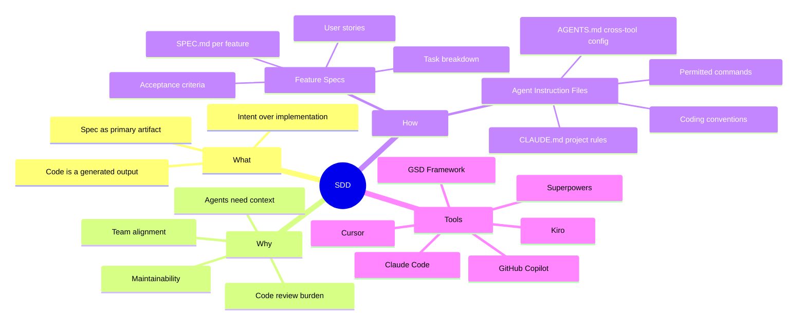

### The Three Levels of SDD

This framework from Martin Fowler's team at Thoughtworks^[https://martinfowler.com/articles/exploring-gen-ai/sdd-3-tools.html] is the clearest way to understand where a team sits on the SDD spectrum:

| Level | Name | What happens to the spec | Analogy |
|-------|------|--------------------------|---------|
| **Level 1** | Spec-First | Written before coding; discarded after | Scaffolding |
| **Level 2** | Spec-Anchored | Lives alongside code; evolves with it | Blueprint stays on site |
| **Level 3** | Spec-as-Source | Spec IS the primary artifact; code is read-only | CAD file generates manufacturing output |

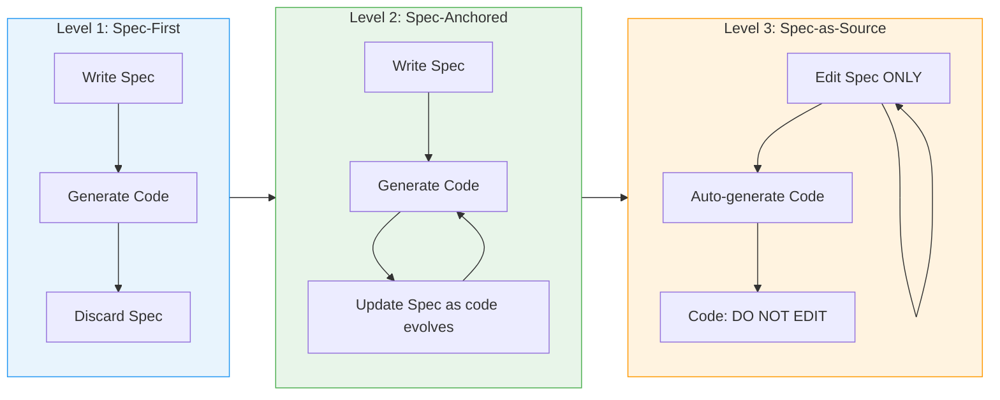

> [!info] Where most teams start
> Level 1 (Spec-First) is the fastest win. Level 3 is ambitious — only [[Tessl]] is pursuing it in production today.

---

## 3. The Foundation: Context Engineering

Before diving into tools, you must understand the underlying principle everything is built on.

### What is Context Engineering?

> *"Context engineering is the art and science of curating what will go into the limited context window from that constantly evolving universe of possible information."* — Anthropic Engineering, 2025

This is the discipline that emerged after prompt engineering plateaued. The insight is simple but profound:

**Most AI agent failures are not model failures. They are context failures.**

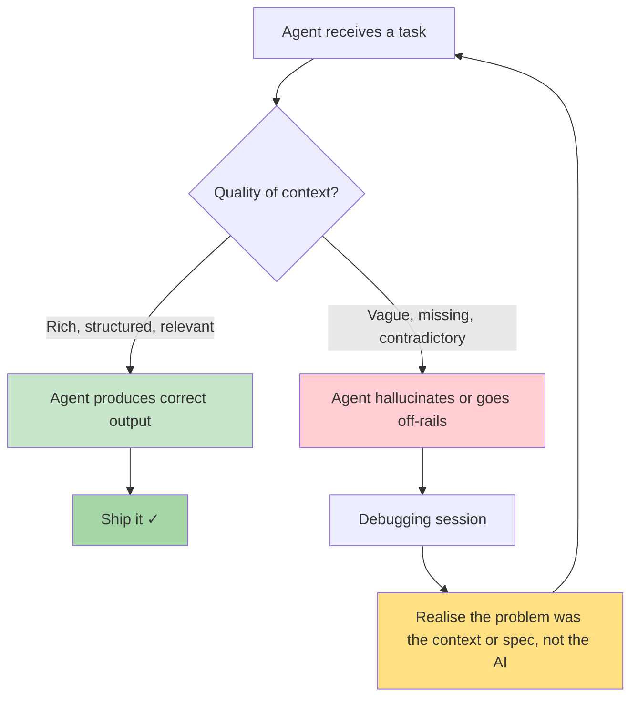

### Context Rot: The Silent Killer

As an AI fills its context window, **recall accuracy drops**. The transformer architecture creates n² pairwise relationships between tokens — more context means more dilution. This phenomenon is called **context rot**.

Tools like GSD and Claude Code's `auto-compact` feature address this directly.

### Two Types of Files in SDD

SDD relies on two fundamentally different types of files. Confusing them is one of the most common mistakes teams make.

| Type | Purpose | Scope | Examples |
|------|---------|-------|---------|
| **Feature Spec** | Describes *what to build* for a specific feature or product | Per feature | `SPEC.md`, `requirements.md`, user story files |
| **Agent Instruction File** | Describes *how the agent should work* across the whole project | Project-wide | `CLAUDE.md`, `AGENTS.md`, `.cursor/rules/`, Kiro steering files |

**Feature Specs answer:** What is being built? For whom? What does done look like?

**Agent Instruction Files answer:** What are the coding conventions? Which commands do I run? What am I never allowed to do?

### The Agent Instruction File Ecosystem

Different tools use different file names, but they solve the same problem: **externalizing project-wide rules so agents can pick them up at session start and work consistently**.

| File | Tool | Who writes it | What it contains |
|------|------|---------------|------------------|
| `CLAUDE.md` | Claude Code | Human | Project rules, commands, style, constraints |
| `AGENTS.md` | Universal standard | Human | Cross-tool portable instructions |
| `.cursor/rules/*.mdc` | Cursor | Human | File-scoped coding rules |
| Steering files | Kiro | Human | Project-wide agent behaviour |
| `MEMORY.md` | Claude Code | The AI | Agent's own session notes |

> [!tip] Key distinction
> **Agent instruction files are NOT specs.** They don't describe a feature to build. They define the working environment the agent operates in — conventions, tools, commands, and guardrails that apply to every task, not just one.

---

## 4. The SDD Workflow

Regardless of tool, every mature SDD workflow follows this pattern:

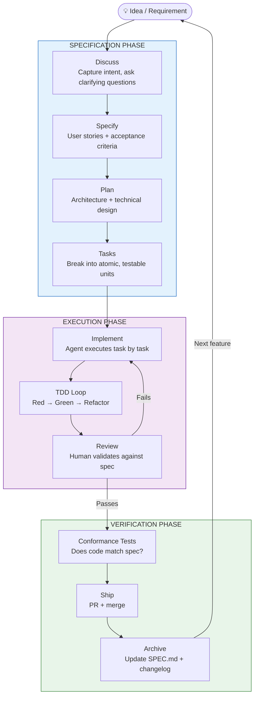

---

## 5. The Tools Landscape

### 5.1 Kiro — Amazon's Spec-First IDE

Kiro is Amazon's VS Code fork (powered by Anthropic Claude), launched in 2025. It is the most opinionated SDD tool available today.

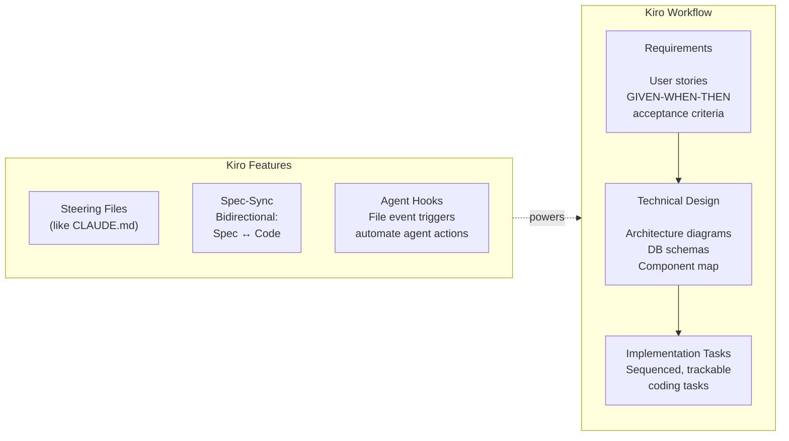

**Real-world impact:** Amazon reported life sciences customers used Kiro to build a drug discovery agent in **3 weeks** that previously would have taken months.^[https://aws.amazon.com/blogs/industries/from-spec-to-production-a-three-week-drug-discovery-agent-using-kiro/]

**Watch out for:** Kiro's workflow can feel heavyweight for small tasks. One developer reported a simple tool expanded to 5,000 lines of code when 800 would suffice — over-engineering driven by over-specified prompts.

---

### 5.2 Cursor — Plan Mode + Rules-Based Context Injection

Cursor's approach to SDD operates on **two distinct layers** that work together. Confusing them is the most common mistake teams make when evaluating Cursor for spec-driven workflows.

> [!important] Two-layer architecture
> **Plan Mode** is the SDD workflow mechanism — it enforces the plan-before-you-build discipline.
> **`.cursor/rules/*.mdc`** is the agent instruction layer — it enforces how the agent works across every session.
> Neither replaces the other.

#### Layer 1: Plan Mode — The SDD Workflow Gate

Plan Mode (introduced in **Cursor 1.7, October 2025**) is Cursor's closest native equivalent to an SDD workflow. It inserts a mandatory planning phase before the agent writes a single line of code.

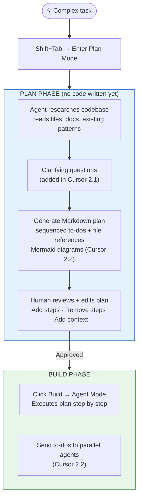

**How Plan Mode relates to SDD:**

| SDD Concept | Plan Mode Equivalent | Gap |
|-------------|---------------------|-----|
| Requirements spec | User's task description | No formal EARS notation or acceptance criteria |
| Technical design | Plan's architecture notes + Mermaid diagrams | Agent-generated, not human-authored |
| Task breakdown | Sequenced to-do list with file paths | Session-scoped, not persistent across sessions |
| Human approval gate | Review step before Build | Exists, but plan is not stored as a tracked artifact by default |

**The key limitation:** Plan Mode plans are **session-scoped, not persistent specs**. Unlike Kiro's requirements files or a team's `SPEC.md`, a Cursor plan is an alignment tool for one agent run — it is not committed to the repo, versioned, or treated as the primary artifact. Cursor explicitly designed it this way: *"The most impactful change you can make is planning before coding"* — it's a workflow habit enforcer, not a spec management system.

You can save plans to the workspace (`Save to workspace`) to retain them as team documentation, which moves Cursor toward Level 2 SDD (Spec-Anchored), but this requires deliberate discipline — the tool does not enforce it.

**Cursor mode hierarchy:**

| Mode | What it does | SDD role |
|------|-------------|---------|
| **Plan Mode** | Research → plan → human approval → hand off to Agent | Pre-flight check; the SDD planning gate |
| **Agent Mode** | Direct implementation, tool use, file edits | Execution layer |
| **Ask Mode** | Discussion only, no code changes | Ideation and requirements clarification |
| **Debug Mode** (2.2) | Specialised error diagnosis | Verification layer |

---

#### Layer 2: Rules-Based Context Injection — The Agent Instruction Layer

The `.cursor/rules/*.mdc` system is Cursor's **agent instruction file** mechanism — separate from Plan Mode and orthogonal to it. Rules fire automatically on every interaction (chat, autocomplete, agent) based on file patterns. They answer *how* the agent should work, not *what* to build.

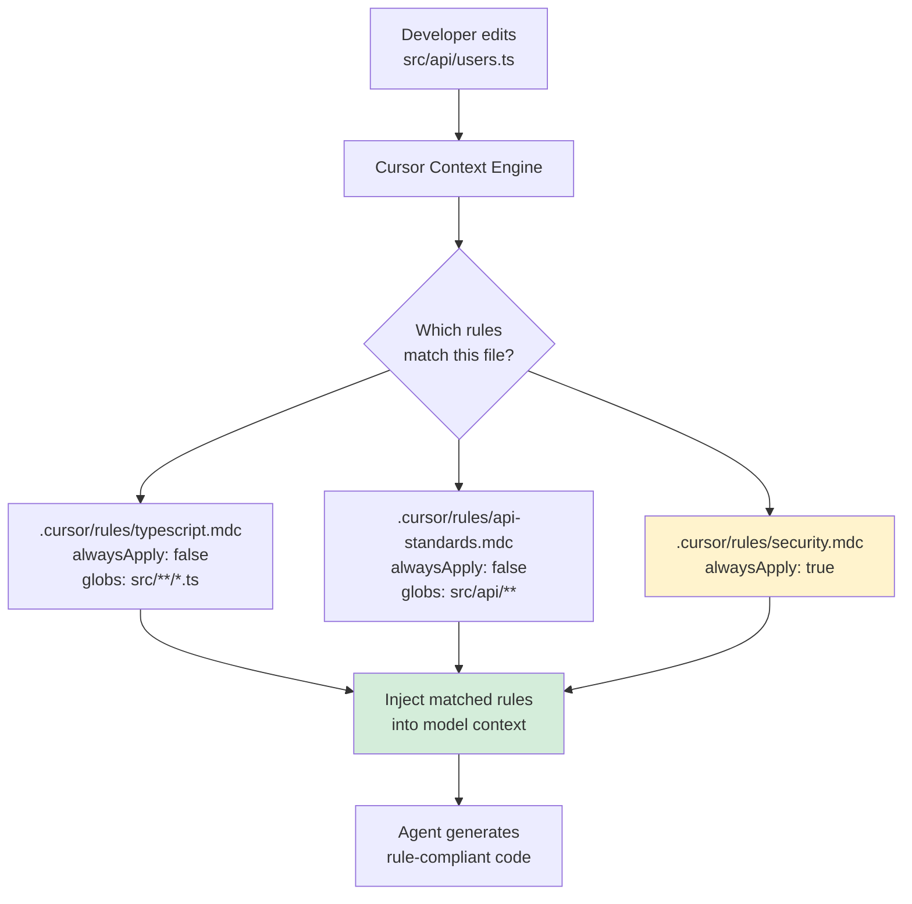

**The `.mdc` rule file structure:**

```yaml
---
description: "TypeScript API endpoint standards"
globs: ["src/api/**/*.ts"]
alwaysApply: false
---

All API endpoints must:
- Use Zod for input validation
- Return typed responses using our ApiResponse<T> wrapper
- Never expose internal error messages to clients
- Log errors with correlation IDs
```

**Rule trigger types:**

| Type | Trigger | Use for |
|------|---------|---------|
| `alwaysApply: true` | Every interaction, no conditions | Security guardrails, global conventions |
| `globs: ["src/api/**"]` | Only when editing matching files | Language-specific or module-specific standards |
| Agent-requested | Agent reads description and self-selects | Contextual rules the agent opts into |

**Documented benefit:** 41% faster feature development cycles in teams using rule-guided AI generation.^[https://docs.cursor.com/context/rules-for-ai]

> [!note] How the two layers interact
> When you use Plan Mode, the `.mdc` rules are **still active in the background** — they inject into the agent while it writes the plan AND while it executes it. Plan Mode provides the workflow structure; rules provide the continuous coding standards enforcement. They are not alternatives.

---

#### Cursor's SDD Limitations — and Community Solutions

Cursor does not enforce the full SDD pipeline natively. There is no built-in mechanism for formal requirements (EARS notation), persistent acceptance criteria, or dependency-ordered task sequencing that Kiro provides out of the box. This is a deliberate design choice: Cursor optimises for speed over process.

The community has built workarounds:

| Tool | What it adds |
|------|-------------|
| [spec-kit-command-cursor](https://github.com/madebyaris/spec-kit-command-cursor) | Adds `/specify`, `/plan`, `/tasks` slash commands to Cursor |
| [OpenSpec](https://forum.cursor.com/t/openspec-lightweight-portable-spec-driven-framework-for-ai-coding-assistants/134052) | Lightweight portable spec-driven framework built specifically for Cursor |
| [cc-sdd](https://github.com/gotalab/cc-sdd) | Kiro-style SDD commands for Cursor, Claude Code, and others |

---

### 5.3 Claude Code — CLAUDE.md + Feature Specs + Plugin Ecosystem

Claude Code is Anthropic's terminal-based coding agent. It has the most extensible SDD story of any tool: a layered context system, custom slash commands as workflow automation, and a plugin ecosystem (Superpowers, GSD) that enforces full SDD discipline.

#### The Two-Layer SDD Architecture

Claude Code SDD uses the same two-layer separation as any mature SDD system:

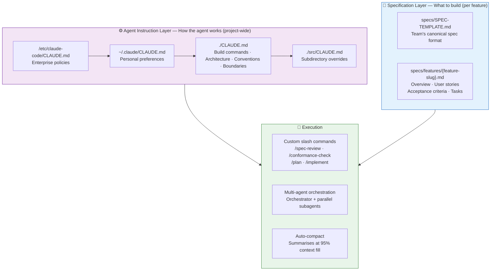

#### The CLAUDE.md — Agent Instruction File

CLAUDE.md is the project-wide working contract between your team and Claude. It is **not** a spec — it answers *how the agent should work*, not *what to build*.

**What belongs in CLAUDE.md (from Anthropic's internal usage):^[https://www-cdn.anthropic.com/58284b19e702b49db9302d5b6f135ad8871e7658.pdf]**
- Exact build/test/deploy commands with all flags
- Architecture decisions and the *why* behind them
- Preferred libraries and why you chose them
- Code style with **examples** (examples beat lengthy descriptions)
- Three-Tier Boundary System: Always Do / Ask First / Never Do
- Where feature specs live and how to read them

The context hierarchy loads bottom-up at session start — subdirectory `CLAUDE.md` files override project-level settings, which override personal preferences, which override enterprise policies.

#### The SDD Workflow in Claude Code

Unlike Kiro, Claude Code does not enforce an SDD pipeline. The discipline is **opt-in**, enforced through the team's CLAUDE.md instructions and custom slash commands:

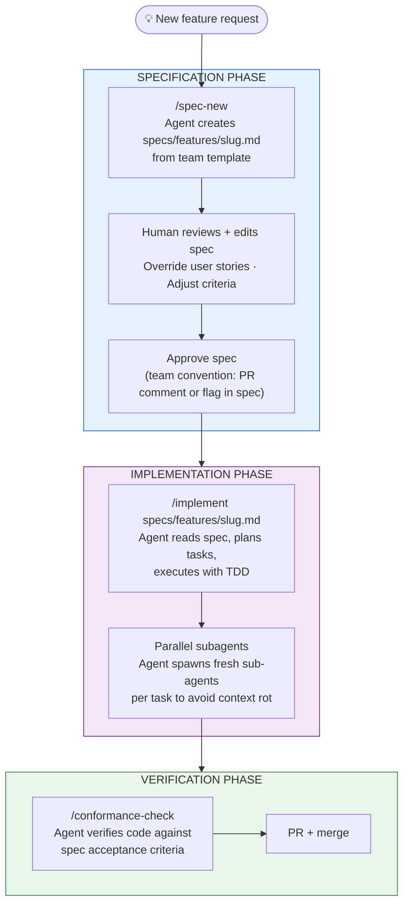

**Custom slash commands are the workflow automation layer.** They live in `.claude/commands/` and are invoked as `/command-name`. Example SDD command set:

| Command | What it does |
|---------|-------------|
| `/spec-new [feature]` | Creates a new spec file from the team template, pre-filled with the feature name |
| `/spec-review` | Reviews the current spec for completeness: missing acceptance criteria, vague stories, unclear tasks |
| `/implement [spec-path]` | Reads the spec, generates a task list, executes TDD per task |
| `/conformance-check` | Diffs the current code against the active spec's acceptance criteria |

#### Plugin Ecosystem — Superpowers and GSD

Claude Code's extensibility means the SDD pipeline can be hardened with two community frameworks. Both are installed as plugins and enforce discipline that the base tool leaves to convention:

- **Superpowers** (see [[#5.5 Superpowers — The Workflow Enforcement Framework]]) — enforces TDD-first SDD with non-negotiable workflow gates (Brainstorm → Plan → TDD → Review → Complete). Pre-TDD code is deleted. Each task gets a fresh subagent. Also works with Cursor, Codex, and Gemini CLI.
- **GSD** (see [[#5.6 GSD (Get Shit Done) — Context Engineering for Production]]) — solves context rot at scale via multi-agent orchestration where each phase (Research, Planning, Execution, Verification) gets a fresh context window. `REQUIREMENTS.md` is GSD's feature spec equivalent.

**When to use each:**

| Capability | Native Claude Code | + Superpowers | + GSD |
|------------|-------------------|--------------|-------|
| Agent instruction files | ✅ CLAUDE.md hierarchy | ✅ | ✅ |
| Feature spec support | Manual convention | ✅ Enforced | ✅ REQUIREMENTS.md |
| TDD enforcement | Manual | ✅ Non-negotiable | Manual |
| Context rot mitigation | Auto-compact | Git worktrees + fresh agents | Fresh agents per phase |
| Multi-agent orchestration | Built-in | Built-in + enforced | ✅ Core design |
| Cross-tool portability | Claude Code only | ✅ 4 tools | Claude Code primary |
| SDD pipeline rigidity | Low (opt-in) | High (enforced) | Medium (structured) |

> [!tip] Which to use
> Start native. Add **Superpowers** if your team keeps skipping TDD or the planning step. Add **GSD** if you're hitting context rot on large codebases. See [[#9. Do You Need a Tool or a Framework?]] for the full decision framework.

---

### 5.4 GitHub Spec Kit — Intent as Source of Truth

GitHub's open-source toolkit^[https://github.com/github/spec-kit] for Copilot, Claude Code, and Gemini CLI.

> *"The coding agent knows what it's supposed to build because the specification told it, knows how to build it because the plan told it, and knows exactly what to work on because the task told it."* — GitHub Engineering Blog

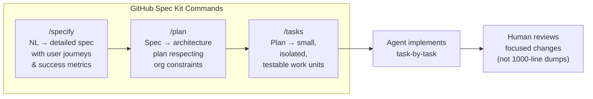

---

### 5.5 Superpowers — The Workflow Enforcement Framework

Superpowers^[https://github.com/obra/superpowers] is not an IDE — it's a **skill system** installed as a plugin across multiple tools (Claude Code, Cursor, Codex, Gemini CLI).

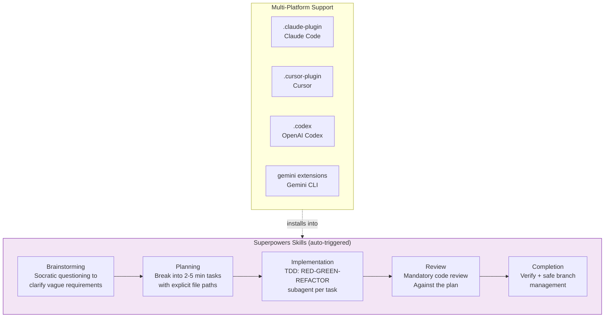

**Key philosophy:** Superpowers enforces **TDD as non-negotiable**. Pre-TDD code is deleted. The system uses Git worktrees for isolated parallel development and assigns fresh sub-agents per task to avoid context rot.

---

### 5.6 GSD (Get Shit Done) — Context Engineering for Production

GSD^[https://github.com/gsd-build/get-shit-done] solves a specific problem: **context rot at scale**. It uses multi-agent orchestration where each phase gets a fresh context window.

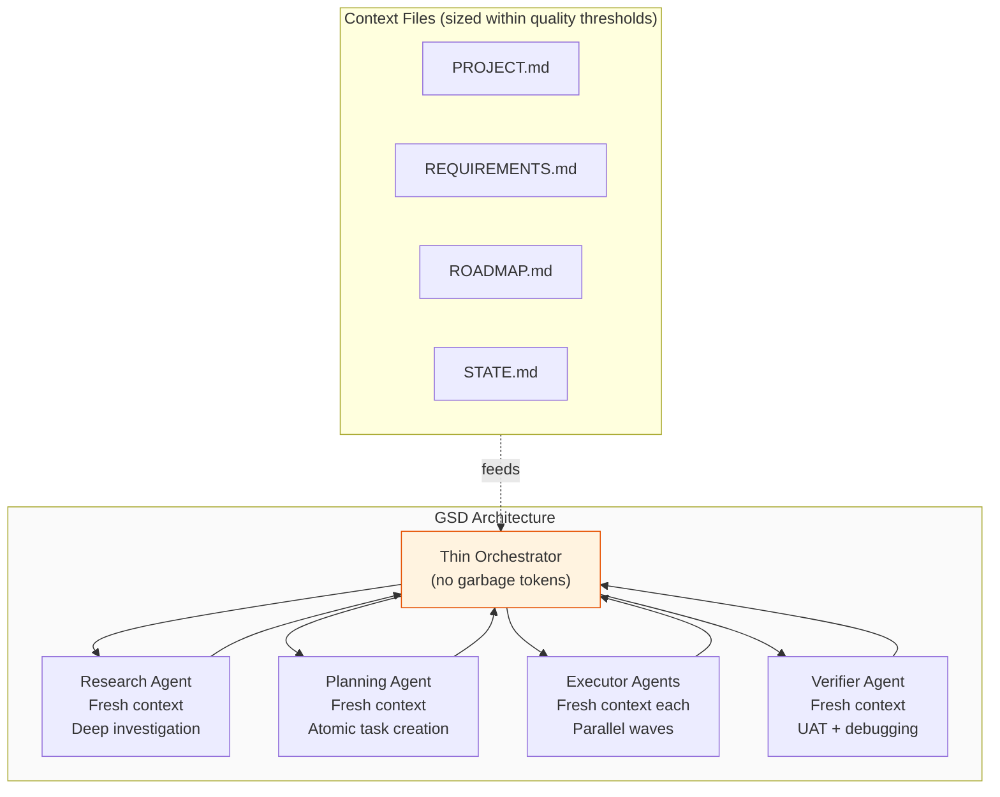

**The insight behind GSD:** Rather than building one giant spec and stuffing it all into one agent, it uses **structured markdown files sized within Claude's quality thresholds** — ensuring each session stays fast, accurate, and free from context rot.

---

### 5.7 Tessl — The Spec-as-Source Pioneer

Tessl is the only tool pursuing **Level 3 SDD** (Spec-as-Source). Currently in private beta.

- 1:1 mapping between spec files and code files
- Auto-generated code is marked with `// DO NOT EDIT`
- Tags like `@generate` and `@test` in spec files
- Bidirectional sync: can reverse-engineer existing code into specs

> [!warning] Early Warning
> Tessl is ambitious but unproven at scale. The Thoughtworks analysis notes that current SDD tools may be "amplifying existing challenges" — a German word captures it perfectly: *Verschlimmbesserung* (making things worse while trying to improve them).

---

## 6. The SDD Architecture Stack

This is how all the pieces fit together:

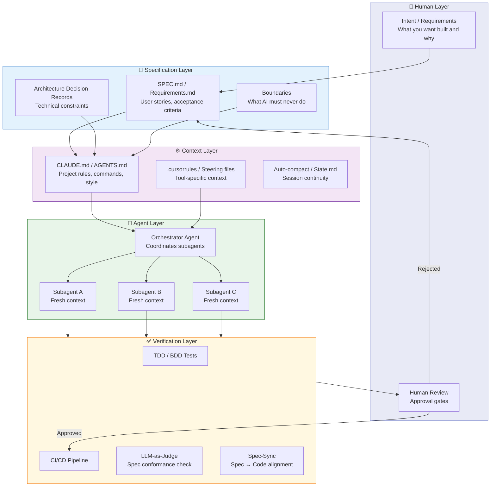

---

## 7. The Vibe Coding vs SDD Debate

In February 2025, Andrej Karpathy coined **"vibe coding"** — describing programming where you describe ideas in natural language and accept whatever the LLM generates without deep understanding. Searches for the term jumped **6,700%** in spring 2025. Collins Dictionary named it Word of the Year 2025.

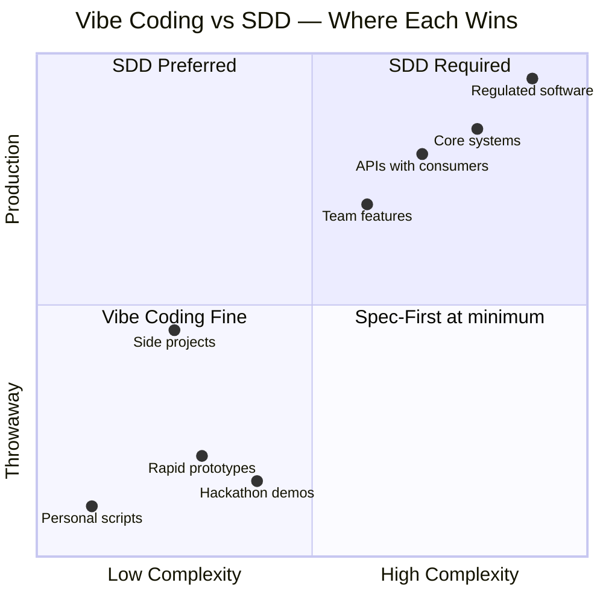

### The Nuanced View

> *"The vibe coding vs. spec-driven development debate was always about information flow. Vibe coding works when you have all the context in your head. Spec-driven development works when you need to communicate context to others."* — Practitioner synthesis, 2025

By late 2025, MIT Technology Review noted:
> *"A loose, vibes-based approach has given way to a systematic approach to managing how AI systems process context."*

**The industry is settling on a layered model:**

| Context level | Approach |
|---------------|----------|
| Personal scripts, throwaway tools | Vibe coding is fine |
| Team features, maintained services | Spec-First minimum |
| Core infrastructure, regulated systems | Spec-Anchored |
| Platform APIs, generated codebases | Spec-as-Source |

---

## 8. Writing Specifications That Work

Based on Addy Osmani's (Google Chrome) widely cited practitioner framework^[https://addyosmani.com/blog/good-spec/] and the GitHub Spec Kit team.

### The Anatomy of a Great Feature Spec

A feature spec is scoped to **one feature or product increment**. It answers: *what are we building, for whom, and how do we know when it's done?*

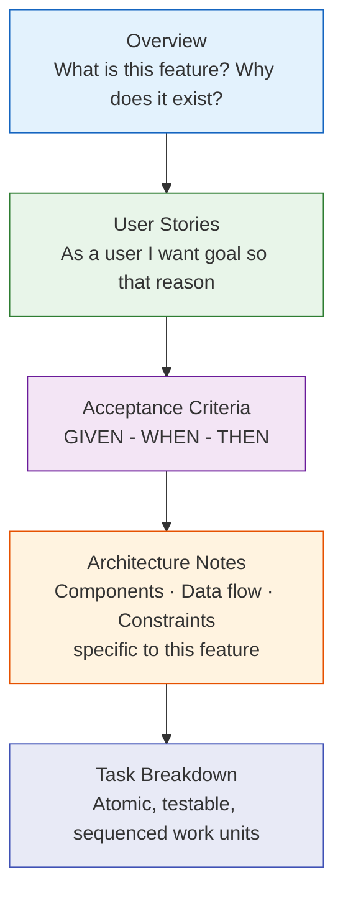

> [!important] What does NOT belong in a feature spec
> Code style, build commands, permitted tools, and agent boundaries **do not belong here**. Those are project-wide concerns that live in your agent instruction file (CLAUDE.md / AGENTS.md). A spec is about *this feature only*.

### What Belongs Where — Side by Side

| Concern | Lives in Feature Spec? | Lives in Agent Instruction File? |
|---------|----------------------|----------------------------------|
| User stories for this feature | ✅ Yes | ❌ No |
| Acceptance criteria | ✅ Yes | ❌ No |
| Architecture for this feature | ✅ Yes | ❌ No |
| Task breakdown | ✅ Yes | ❌ No |
| Coding conventions (TypeScript, naming) | ❌ No | ✅ Yes |
| Build / test / deploy commands | ❌ No | ✅ Yes |
| What the agent is never allowed to do | ❌ No | ✅ Yes |
| Preferred libraries and why | ❌ No | ✅ Yes |

### The Three-Tier Boundary System (Goes in Your Agent Instruction File)

Agent instruction files (CLAUDE.md / AGENTS.md) need explicit permission boundaries. These are **not** per-feature — they apply to everything the agent does:

| Tier | What it means | Example |
|------|--------------|---------|
| **Always Do** | Safe, no approval needed | Run tests, read files, format code |
| **Ask First** | High-impact, needs human review | Change DB schema, add dependencies |
| **Never Do** | Hard stops | Commit secrets, delete prod data, push to main |

### Anti-Patterns to Avoid

> [!danger] The Curse of Instructions
> Too many rules in your agent instruction file **decrease** adherence. More instructions ≠ better agent behaviour. Keep CLAUDE.md/AGENTS.md focused and hierarchical.

- Writing feature specs that include implementation rules (how) instead of requirements (what)
- Dumping build commands, style rules, and feature requirements into a single file
- Vague specs without clear acceptance criteria — agents will fill the gaps incorrectly
- Skipping human review gates between spec → code → ship
- The "lethal trifecta": **speed + non-determinism + cost** without human oversight

### The AGENTS.md Standard (An Agent Instruction File, Not a Spec)

The Linux Foundation's Agentic AI Foundation is converging on `AGENTS.md` as a **cross-tool universal agent instruction file** supported by Claude Code, Cursor, GitHub Copilot, Gemini CLI, and Windsurf. It is the project-wide working contract between your team and your AI agents — covering conventions, tools, and boundaries that apply across all features. If your team uses multiple tools, one shared `AGENTS.md` + tool-specific supplements is the ideal architecture.

---

## 9. Do You Need a Tool or a Framework?

This is the core question your team must answer.

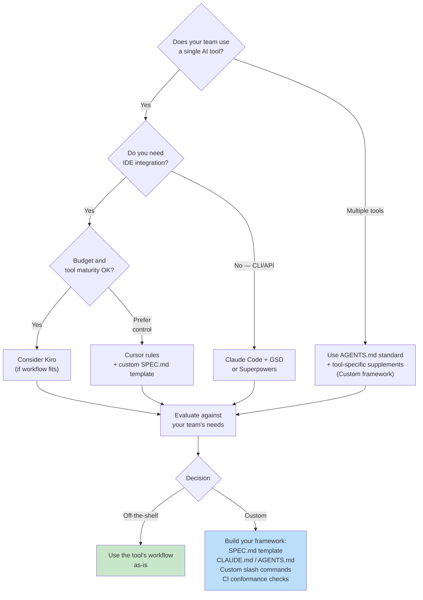

### Arguments for a Custom Team Framework

**When to build your own:**
- You use multiple AI tools (Claude Code today, Cursor tomorrow)
- Your domain has specific constraints not covered by generic tools
- You want to own the workflow without vendor lock-in
- Your team is experienced enough to maintain the framework

**The minimal viable custom framework looks like:**

```
your-project/
│
│  ── AGENT INSTRUCTION FILES (project-wide, not feature-specific) ──
├── AGENTS.md              ← Universal rules: conventions, boundaries, commands
├── CLAUDE.md              ← Claude Code specifics (extends AGENTS.md)
├── .cursor/rules/         ← Cursor file-scoped rules
│
│  ── FEATURE SPECIFICATION FILES (one per feature, describes what to build) ──
├── specs/
│   ├── SPEC-TEMPLATE.md   ← Your team's feature spec template
│   └── features/
│       ├── user-auth.md   ← Spec for user authentication feature
│       └── payments.md    ← Spec for payments feature
│
│  ── SHARED DOCUMENTATION ──
├── docs/
│   ├── architecture.md    ← ADRs and system-wide design
│   └── boundaries.md      ← What AI can/cannot do (feeds into AGENTS.md)
│
└── .claude/commands/      ← Reusable slash commands
    ├── spec-review.md
    └── conformance-check.md
```

---

## 10. What Makes SDD Actually Work?

Based on evidence from practitioners and academic research:^[https://arxiv.org/html/2602.00180v1]

### The Five Pillars

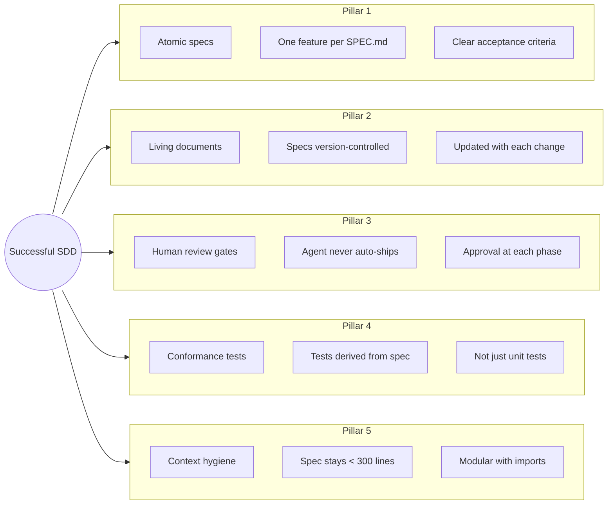

### The Unresolved Challenges (Be Honest With Your Team)

> [!warning] Known Hard Problems
> These are not solved by any tool today:

1. **Spec Drift** — Specs and code diverge over time. Kiro's spec-sync is the most direct attempt to solve this.
2. **Instruction Following** — Despite detailed specs, agents frequently ignore or misinterpret instructions. *LLM interpretation remains probabilistic.*
3. **Review Burden** — Extensive markdown can feel more cumbersome than reviewing code directly. Track this honestly.
4. **Role Shift** — SDD repositions engineers toward product management. Some developers resist this; others thrive.
5. **The Curse of Instructions** — More rules can paradoxically decrease adherence. Find the right density.

---

## 11. Academic Grounding

The field is moving fast. Key papers worth reading:

| Paper | Key Finding |
|-------|-------------|
| *Spec-Driven Development: From Code to Contract* (arxiv 2025)^[https://arxiv.org/html/2602.00180v1] | Foundational framework: spec-first, spec-anchored, spec-as-source |
| *Formalising Software Requirements with LLMs* (arxiv 2025)^[https://arxiv.org/html/2506.11874v1] | Assertion generation achieves >89% reliability; full contract synthesis remains unreliable |
| *LLMs for Formal Requirements* (ACM 2025)^[https://dl.acm.org/doi/10.1016/j.infsof.2025.107697] | Hybrid neuro-symbolic approaches (LLM + formal verifier) show most promise |
| *Context Engineering for Multi-Agent LLM Assistants* (arxiv 2025)^[https://arxiv.org/html/2508.08322v1] | Context engineering techniques in multi-agent architectures |

**Key quote from the foundational paper:**
> *"Specifications act as super-prompts that break down complex problems into modular components aligned with agents' context windows."*

---

## 12. Recommendations for Your Team

Based on this full landscape survey, here is a practical path forward:

### Phase 1 — Start Now (Week 1-2)
- [ ] Create `AGENTS.md` as your universal **agent instruction file** (project-wide rules, conventions, commands — works across all tools)
- [ ] Create a `SPEC-TEMPLATE.md` for your team's **feature spec** format (user stories, acceptance criteria, tasks)
- [ ] Define your Three-Tier Boundary System and put it in `AGENTS.md`, not in any feature spec
- [ ] Write a `SPEC.md` for your next feature branch — even one Level 1 (spec-first, discard after) attempt

### Phase 2 — Build Your Framework (Month 1)
- [ ] Create Claude Code custom slash commands for your common workflows
- [ ] Establish spec review as part of your PR process
- [ ] Write conformance tests derived from specs for one module

### Phase 3 — Evaluate Tools (Month 2-3)
- [ ] Run a Kiro pilot on a greenfield feature
- [ ] Benchmark: does spec-driven work faster than your current workflow?
- [ ] Decide: adopt a tool, adapt a framework, or build your own

### The North Star Principle

> *"You are no longer just writing code. You are writing intent. The agent writes the code. Your job is to make your intent unambiguous."*

---

## Related Notes

- [[Context Engineering]] — The meta-discipline behind SDD
- [[Vibe Coding]] — The contrast case and where it still makes sense
- [[CLAUDE.md Best Practices]] — Writing effective project context files
- [[TDD with AI Agents]] — How Test-Driven Development maps to SDD
- [[Model-Driven Development]] — The predecessor that failed (and why SDD might succeed)
- [[Multi-Agent Orchestration]] — How subagents enable parallel SDD workflows
- [[Kiro IDE]] — Amazon's SDD-native IDE deep dive
- [[Cursor Rules System]] — Cursor's approach to persistent context
- [[GitHub Spec Kit]] — GitHub's open-source SDD toolkit

---

## Sources

1. Fowler, M. et al. — *Understanding Spec-Driven-Development: Kiro, spec-kit, and Tessl* — https://martinfowler.com/articles/exploring-gen-ai/sdd-3-tools.html
2. Osmani, A. — *How to write a good spec for AI agents* — https://addyosmani.com/blog/good-spec/
3. GitHub Engineering — *Spec-driven development with AI* — https://github.blog/ai-and-ml/generative-ai/spec-driven-development-with-ai-get-started-with-a-new-open-source-toolkit/
4. Superpowers Framework — https://github.com/obra/superpowers
5. GSD Framework — https://github.com/gsd-build/get-shit-done
6. arxiv — *Spec-Driven Development: From Code to Contract* — https://arxiv.org/html/2602.00180v1
7. arxiv — *Formalising Software Requirements with LLMs* — https://arxiv.org/html/2506.11874v1
8. Anthropic Engineering — *Effective Context Engineering* — https://www.anthropic.com/engineering/effective-context-engineering-for-ai-agents
9. Kiro IDE — https://kiro.dev/
10. Thoughtworks — *Spec-driven development: unpacking one of 2025's key practices* — https://www.thoughtworks.com/en-us/insights/blog/agile-engineering-practices/spec-driven-development-unpacking-2025-new-engineering-practices
11. MIT Technology Review — *From vibe coding to context engineering* — https://www.technologyreview.com/2025/11/05/1127477/
12. Cursor Docs — *Rules for AI* — https://docs.cursor.com/context/rules-for-ai
13. GitHub Spec Kit — https://github.com/github/spec-kit
14. AWS Blog — *Drug discovery agent with Kiro* — https://aws.amazon.com/blogs/industries/from-spec-to-production-a-three-week-drug-discovery-agent-using-kiro/

---

## Templates

Ready-to-use templates for your team:

- [[agents-template|AGENTS.md Template]] — Universal agent instruction file (works with Claude Code, Cursor, Copilot, Gemini CLI, Windsurf)
- [[spec-template|SPEC-TEMPLATE.md Template]] — Feature specification template with user stories, acceptance criteria, and task tracking
